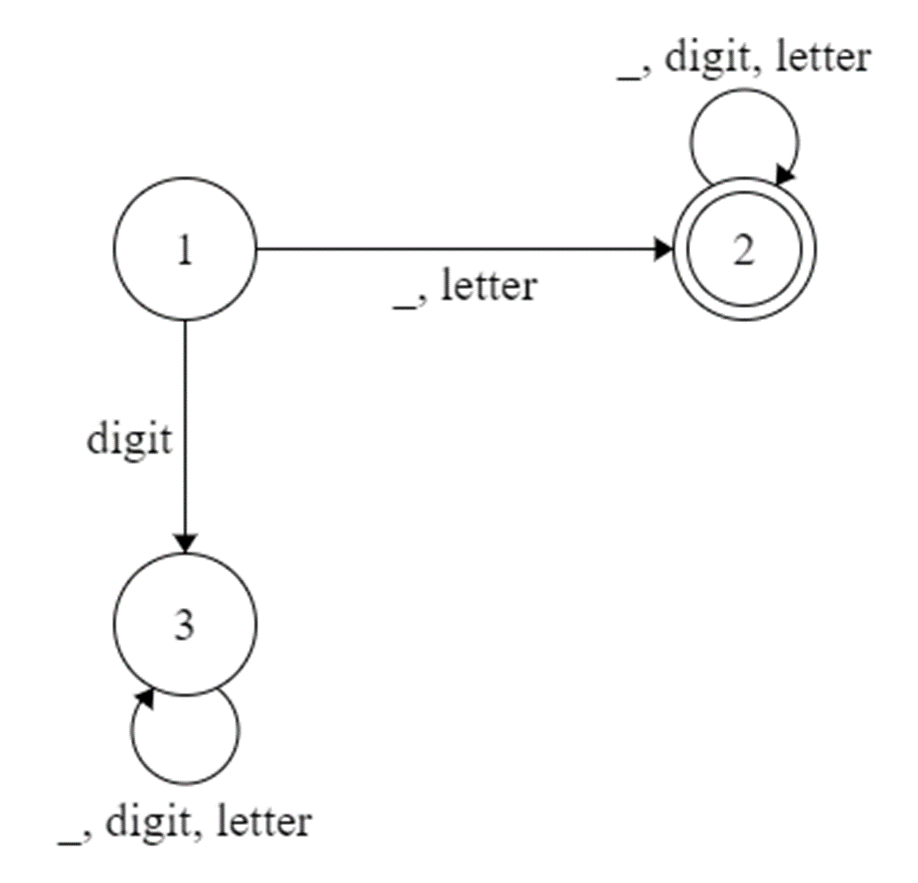

# Naming Variables in Programming Languages

## **Rule:** Variable names can contain underscores, letters and digits but it can start with an underscore or a letter only and not with a digit. 

## **DFA: Formal Representation**

## Possible States Q: {1, 2, 3}

## Input Σ: { _, letter, digit}

## δ:  Transition Table
Current State | Symbol Read | State To Go
--------------|-------------|------------
1 | _, letter | 2(accept)
1 | digit | 3
3 | _, letter, digit | 3
2 | _, letter, digit | 2(accept)  

## Initial/Start State q0: 1

## Final/Accept  State F: {2}

## **DFA Diagram for Naming Variables**

